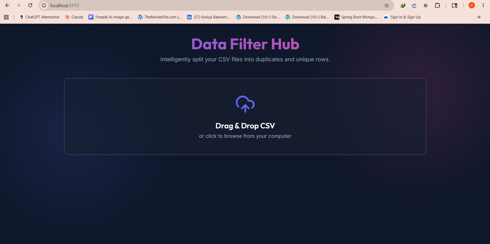
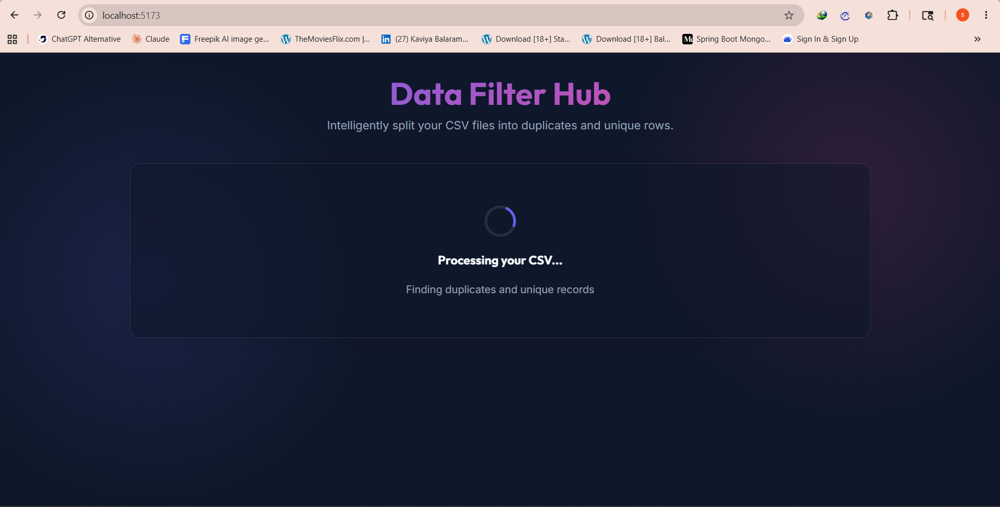
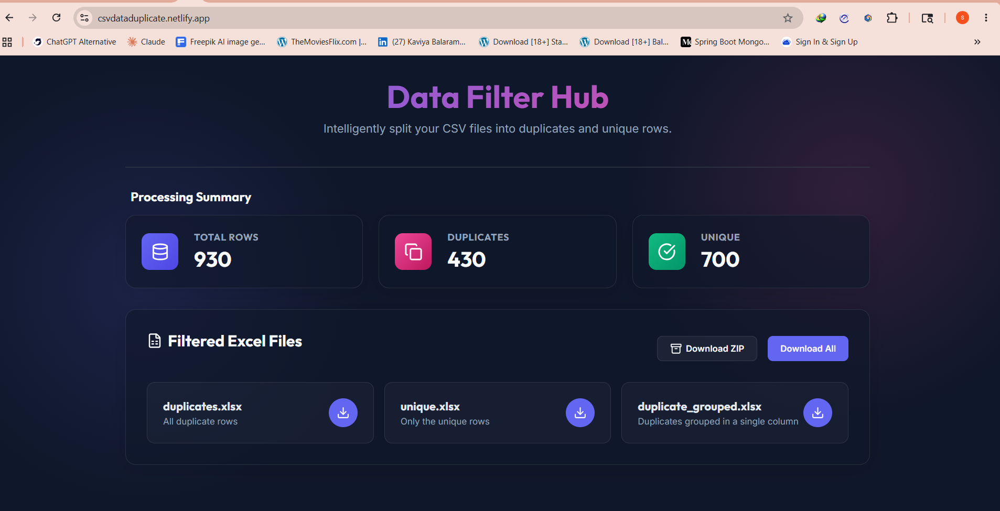
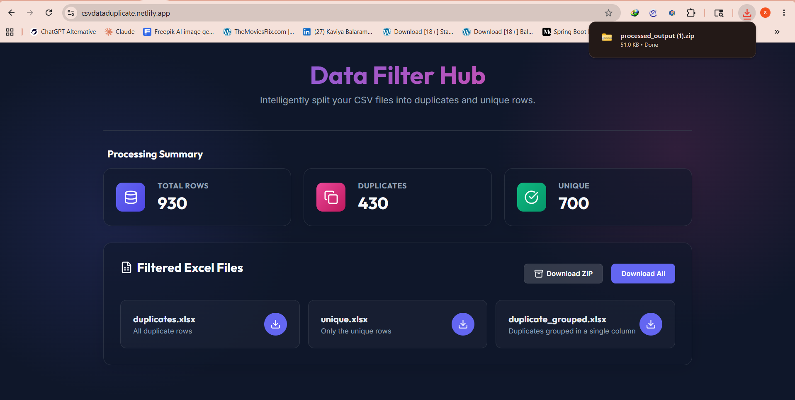

# CSV FRONTEND README


**🔗 Live Demo:** [https://csvdataduplicate.netlify.app](https://csvdataduplicate.netlify.app)  
**🔗 Documentation Site:** [https://subburathinam-m.github.io/csv-processor-docs/](https://subburathinam-m.github.io/csv-processor-docs/)
**🔗 Backend API:** [https://your-api.onrender.com/docs](https://your-api.onrender.com/docs)  
**🔗 Backend Repo:** [github.com/subburathinam-M/csv-backend](https://github.com/subburathinam-M/csv-backend)   
**🔗 Documentation Repo:** [https://github.com/subburathinam-M/csv-processor-docs](https://github.com/subburathinam-M/csv-processor-docs)


---

## 📖 Overview

The **React frontend** for the CSV Data Duplicate Checker — a modern, responsive web interface that allows users to upload CSV files, view real-time processing statistics, and download cleaned Excel files.

Built with **React 19**, **Vite**, and **Axios**, this frontend communicates with a FastAPI backend to perform intelligent duplicate detection using Pandas.

---

## 🎨 Features

| Feature | Description | Status |
|---------|-------------|--------|
| **Drag & Drop Upload** | react-dropzone powered file upload with CSV validation | ✅ |
| **Real-time Stats** | Live display of total, duplicate, and unique row counts | ✅ |
| **Glassmorphism UI** | Modern frosted-glass design with gradient accents | ✅ |
| **Responsive Design** | Mobile-first layout that works on all screen sizes | ✅ |
| **Individual Downloads** | Download each processed file separately | ✅ |
| **ZIP Download** | Download all files as a single compressed archive | ✅ |
| **Loading States** | Animated spinner during processing with server wake-up messages | ✅ |
| **Error Handling** | User-friendly error messages for invalid files or server issues | ✅ |

---

## 🛠️ Tech Stack

| Technology | Purpose | Version |
|------------|---------|---------|
| **React** | UI component library | 19.x |
| **Vite** | Build tool & dev server | 8.x |
| **Axios** | HTTP client for API calls | 1.16.x |
| **react-dropzone** | Drag & drop file upload | 15.x |
| **lucide-react** | Icon library | 1.16.x |
| **JSZip** | Client-side ZIP handling | 3.10.x |
| **CSS Variables** | Theme & styling system | - |

---

## 🏗️ Project Structure

```
📁 csv-frontend/
├── 📁 public/
│   └── 📄 favicon.svg                 # 🎨 App icon
│
├── 📁 src/
│   ├── 📁 components/
│   │   ├── 📄 DropZoneArea.jsx        # 🎯 Drag & drop upload zone
│   │   │                                # Uses react-dropzone for file handling
│   │   │                                # MIME type validation (text/csv)
│   │   │                                # Active/passive drag state styling
│   │   │
│   │   ├── 📄 FileDownloads.jsx       # 💾 Download cards & ZIP button
│   │   │                                # Individual file download links
│   │   │                                # ZIP archive download
│   │   │                                # Staggered multi-download
│   │   │
│   │   ├── 📄 Header.jsx              # 🎨 App title & description
│   │   │                                # Gradient text heading
│   │   │                                # Subtitle with project info
│   │   │
│   │   └── 📄 StatsDashboard.jsx      # 📊 Processing statistics display
│   │                                    # Total rows card
│   │                                    # Duplicates card (pink gradient)
│   │                                    # Unique rows card (green gradient)
│   │
│   ├── 📁 assets/
│   │   └── 📄 (static images/icons)   # 🖼️ Static assets
│   │
│   ├── 📄 App.jsx                     # 🏠 Main app container
│   │                                    # Central state management
│   │                                    # File upload handler
│   │                                    # API integration logic
│   │                                    # Conditional rendering (loading/error/stats)
│   │
│   ├── 📄 App.css                     # 🎨 Component-specific styles
│   │                                    # Dropzone styling
│   │                                    # Stats grid & cards
│   │                                    # Download section
│   │                                    # Loading spinner animations
│   │
│   ├── 📄 index.css                   # 🌐 Global theme & CSS variables
│   │                                    # Color palette (indigo, pink, emerald)
│   │                                    # Glassmorphism utilities
│   │                                    # Scrollbar styling
│   │                                    # Font imports (Outfit, Inter)
│   │
│   └── 📄 main.jsx                    # ⚛️ React entry point
│                                        # ReactDOM.createRoot
│                                        # StrictMode wrapper
│
├── 📄 index.html                      # 📄 HTML template
│                                        # Meta tags & viewport
│                                        # Root div mount point
│
├── 📄 vite.config.js                  # ⚡ Vite configuration
│                                        # @vitejs/plugin-react
│                                        # Build optimizations
│
├── 📄 package.json                    # 📦 Dependencies & scripts
│                                        # dev, build, preview, lint
│
├── 📄 eslint.config.js                # 🔍 ESLint rules
│                                        # React hooks & refresh plugins
│
└── 📄 README.md                       # 📖 This file
```

---

## 🔄 How It Works

### Component Data Flow

```
┌─────────────────────────────────────────────────────────────┐
│                     COMPONENT ARCHITECTURE                  │
└─────────────────────────────────────────────────────────────┘

                    ┌───────────────┐
                    │   App.jsx      │
                    │  (State Hub)   │
                    └───────┬───────┘
                            │
        ┌───────────────────┼───────────────────┐
        │                   │                   │
        ▼                   ▼                   ▼
   ┌─────────┐       ┌─────────────┐       ┌─────────────┐
   │ Header  │       │ DropZoneArea│       │StatsDashboard│
   │ (Static)│       │ (Upload)    │       │ (Results)   │
   └─────────┘       └─────────────┘       └─────────────┘
                            │
                            ▼
                    ┌───────────────┐
                    │ FileDownloads │
                    │  (Downloads)  │
                    └───────────────┘
```

### State Management

```javascript
// App.jsx central state
const [file, setFile] = useState(null);           // Uploaded file
const [loading, setLoading] = useState(false);    // Processing state
const [stats, setStats] = useState(null);         // { total, duplicates, unique }
const [files, setFiles] = useState([]);           // Downloadable file objects
const [error, setError] = useState(null);         // Error message
const [rawZipBlob, setRawZipBlob] = useState(null); // ZIP blob for download
```

### API Integration Flow

```
User drops CSV
    │
    ▼
react-dropzone validates MIME type
    │
    ▼
App.jsx onDrop handler triggered
    │
    ▼
Axios POST /api/v1/csv/process
    ├── FormData with File object
    ├── Content-Type: multipart/form-data
    └── responseType: 'blob' (binary ZIP)
    │
    ▼
Backend processes & returns ZIP + headers
    │
    ▼
Frontend extracts headers:
    ├── X-Total-Rows
    ├── X-Duplicate-Rows
    └── X-Unique-Rows
    │
    ▼
JSZip extracts ZIP contents
    │
    ▼
Object URLs created for each file
    │
    ▼
StatsDashboard & FileDownloads render
```

---

## ⚡ Key Concepts Used

### React Components

```jsx
// Functional component with props
const DropZoneArea = ({ onDrop }) => {
  const onDropCallback = useCallback((acceptedFiles) => {
    onDrop(acceptedFiles);
  }, [onDrop]);

  const { getRootProps, getInputProps, isDragActive } = useDropzone({
    onDrop: onDropCallback,
    accept: { 'text/csv': ['.csv'] },
    multiple: false
  });

  return (
    <div {...getRootProps()} className={`dropzone ${isDragActive ? 'active' : ''}`}>
      <input {...getInputProps()} />
      <UploadCloud className="dropzone-icon" />
      <h3>{isDragActive ? "Drop your CSV here" : "Drag & Drop CSV"}</h3>
    </div>
  );
};
```

### Props vs State

| | Props | State |
|--|-------|-------|
| **Direction** | Parent → Child | Component-internal |
| **Mutability** | Read-only | Mutable via setState |
| **Example** | `onDrop` callback passed to DropZoneArea | `stats` object in App.jsx |
| **Triggers re-render** | When parent updates | When setState called |

### Axios File Upload

```javascript
const handleUpload = async (acceptedFiles) => {
  const formData = new FormData();
  formData.append('file', acceptedFiles[0]);

  const response = await axios.post(
    'https://your-api.onrender.com/api/v1/csv/process',
    formData,
    {
      headers: { 'Content-Type': 'multipart/form-data' },
      responseType: 'blob'  // Critical for binary ZIP data
    }
  );

  // Extract statistics from response headers
  const stats = {
    total: parseInt(response.headers['x-total-rows']),
    duplicates: parseInt(response.headers['x-duplicate-rows']),
    unique: parseInt(response.headers['x-unique-rows'])
  };
};
```

### Async/Await Pattern

```javascript
const processFile = async (file) => {
  setLoading(true);   // Show spinner
  setError(null);     // Clear previous errors

  try {
    const result = await uploadToBackend(file);
    setStats(result.stats);
    setFiles(result.files);
  } catch (err) {
    setError(err.message);
  } finally {
    setLoading(false);  // Hide spinner
  }
};
```

### Conditional Rendering

```jsx
{loading && <LoadingSpinner />}
{error && <ErrorMessage message={error} />}
{stats && <StatsDashboard stats={stats} />}
{files.length > 0 && <FileDownloads files={files} />}
```

---

## 🚀 Getting Started

### Prerequisites

| Requirement | Version |
|-------------|---------|
| Node.js | 18+ |
| npm or yarn | Latest |
| Git | Latest |

### Installation

```bash
# 1. Clone the repository
git clone https://github.com/yourname/csv-frontend.git
cd csv-frontend

# 2. Install dependencies
npm install

# 3. Start development server
npm run dev

# 4. Open browser
# http://localhost:5173
```

### Available Scripts

| Command | Description |
|---------|-------------|
| `npm run dev` | Start Vite dev server with HMR |
| `npm run build` | Production build to `dist/` |
| `npm run preview` | Preview production build locally |
| `npm run lint` | Run ESLint on source files |

### Environment Variables

Create `.env` file in project root:

```env
VITE_API_URL=https://your-api.onrender.com
```

Access in code:
```javascript
const API_URL = import.meta.env.VITE_API_URL;
```

---

## 🚀 Deployment

### Netlify Deployment

1. **Push code to GitHub**
```bash
git add .
git commit -m "Ready for deployment"
git push origin main
```

2. **Connect to Netlify**
   - Go to [netlify.com](https://netlify.com)
   - Click "Add new site" → "Import an existing project"
   - Select your GitHub repo

3. **Build Configuration**
   | Setting | Value |
   |---------|-------|
   | Build command | `npm run build` |
   | Publish directory | `dist` |

4. **Environment Variables**
   - `VITE_API_URL`: `https://your-api.onrender.com`

5. **Deploy**
   - Netlify auto-deploys on every git push to main

---

## 🚧 Challenges Faced

| Challenge | Solution |
|-----------|----------|
| **CORS Errors** | Backend CORS middleware whitelists Netlify origin. Frontend uses `withCredentials: false` for simple requests. |
| **Binary Response Handling** | Set `responseType: 'blob'` in Axios config. Without this, ZIP data gets corrupted. |
| **Server Cold Starts** | Render free tier sleeps after 15 min. Added loading message: "Waking up server..." |
| **File URL Generation** | Used `URL.createObjectURL(blob)` to create temporary download links from binary data. |
| **ZIP Extraction** | Used JSZip library to unpack the ZIP in browser and extract individual Excel files. |
| **Responsive Glassmorphism** | CSS `backdrop-filter` with fallbacks. Used `@supports` for browser compatibility. |

---

## 🔮 Future Improvements

| Feature | Description | Priority |
|---------|-------------|----------|
| **Drag & Drop Enhancements** | Multi-file upload, progress bar, file size preview | Medium |
| **Dark/Light Theme Toggle** | Theme switcher with CSS variables | Low |
| **Animation Library** | Framer Motion for page transitions | Low |
| **PWA Support** | Service worker for offline capability | Low |

---

## 📸 Screenshots

| Screen | Preview |
|--------|---------|
| **Upload Zone** |  |
| **Processing** |  |
| **Stats Dashboard** |  |
| **Downloads** |  |

> Add your screenshots to `docs/screenshots/` folder

---

## 👤 Author

<div align="center">

**Your Name**

Frontend Developer | React · Vite · CSS

[](https://github.com/subburathinam-M/)
[](https://www.linkedin.com/in/subburathinam22/)
[](https://subburathinam-m.github.io/MyPortfolio/#)

</div>

---

## 📄 License

This project is licensed under the **MIT License** - see the [LICENSE](LICENSE) file for details.

---

<div align="center">

⭐ Star this repo if you find it helpful!

🚀 Built with ❤️ using **React**, **Vite**, and **Axios**

</div>
